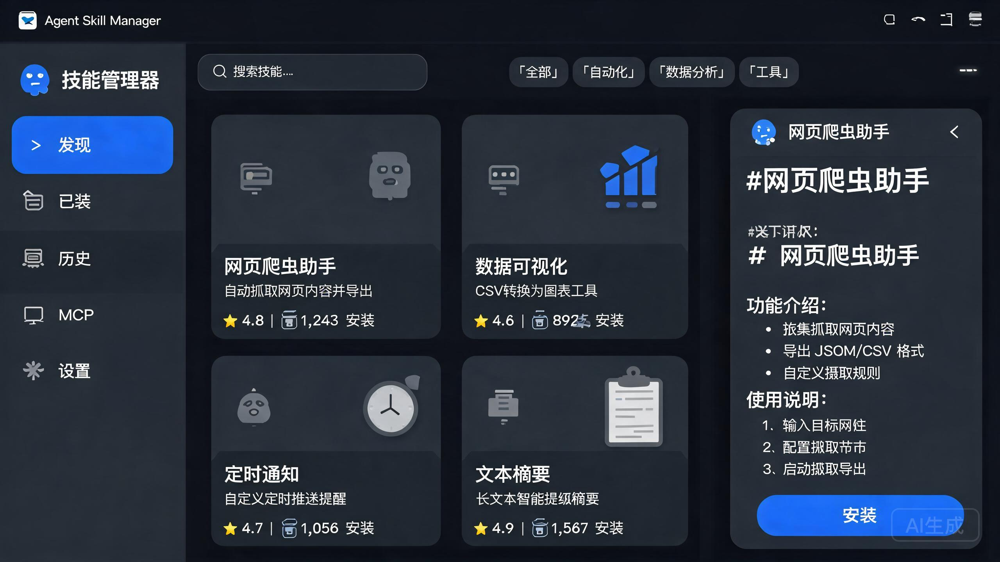

<div align="center">

# TRAE Skill Manager


**桌面端 Agent Skills + MCP Server 搜索、安装与管理工具**——内置技能市场 + GitHub 社区搜索，事务化安装、流式终端输出、一键启用/停用，全流程在 Rust 侧完成。

</div>

---

## 🧰 这是什么？

TRAE Skill Manager 是一个 **Tauri 桌面应用**，用于**发现、安装和管理 Agent Skills 与 MCP Server**。你可以跨仓库搜索技能、查看 README、一眼读懂事务化安装流程（实时终端输出），并管理已装技能的启用 / 停用与升级。

## ✨ 核心功能

- 🔍 **技能市场发现**：`all-time / trending / browse` 视图，支持分类 / 标签 / 来源过滤与多字段排序
- 📦 **事务化安装**：依次尝试 `git clone → npx degit → npx skills add`，**temp → 验证 → move**，失败自动降级
- 🖥️ **流式终端体验**：Rust 侧 `emit` 安装事件，前端 `TerminalViewer` 实时显示 stdio 输出
- 📂 **已装技能管理**：扫描 / 移除 / 启用/停用 / 升级
- 🐙 **GitHub 社区搜索**：内置市场 + GitHub 双通道，README 抓取带 **5 分钟 TTL 缓存**
- 🧩 **MCP Server 市场**：内置分类（dev-tools / database / browser / search…），配置对话框 + 详情面板
- 📋 **安装历史** + 项目切换 + 自定义安装路径（`skill_path_hint` 递归定位）
- 🌐 **技能描述翻译**

## 🧱 技术栈

| 层 | 技术 |
|----|------|
| 前端 | React 18 · TypeScript · Vite |
| 状态 | Zustand（skillStore / mcpStore） |
| 动画 | motion |
| 桌面后端 | Tauri（Rust），命令拆分为 `commands/*` |
| 构建 | pnpm workspace · sharp 生成多尺寸图标 |

## 🏗️ 目录结构

```
src/
├── components/       # Discover / Installed / History / Mcp / Settings / DetailPanel / TerminalViewer
├── store/            # skillStore.ts · mcpStore.ts
├── lib/              # mcpMarketplace.ts · animations.ts
└── types/
src-tauri/src/
├── commands/         # install/scan/remove/toggle/update/translate/search_github/fetch/history...
├── models.rs · lib.rs · main.rs
└── utils/path.rs
```

## 🚀 快速开始

```bash
pnpm install
pnpm run dev           # 纯前端 Vite
pnpm run tauri dev     # 桌面调试
pnpm run tauri build   # 打桌面安装包
```

## 🖼️ 界面预览



*发现页技能卡片网格：分类、排序与搜索。*

## 📚 文档

- [`BUILD.md`](BUILD.md) — 构建指南
- [`INSTALL_OPTIMIZATION_DESIGN.md`](INSTALL_OPTIMIZATION_DESIGN.md) — 安装优化设计

---

<div align="center">Made with ❤️ at XJU · N-H-A-S</div>