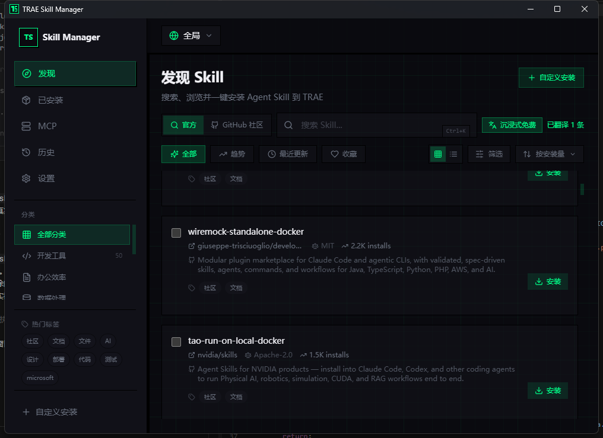
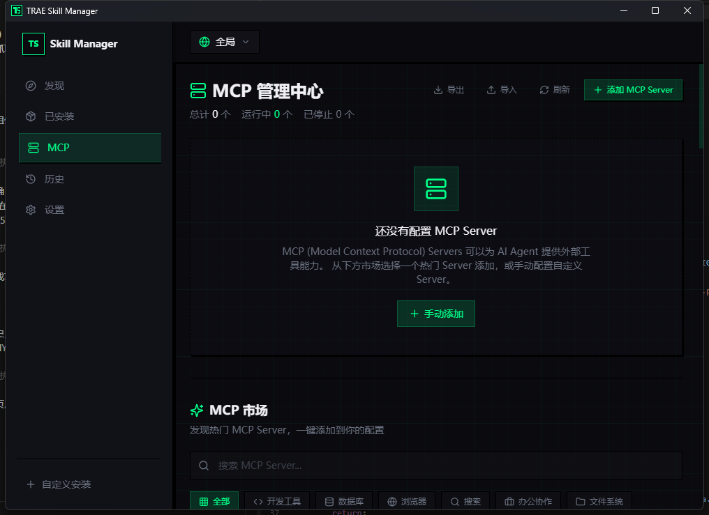
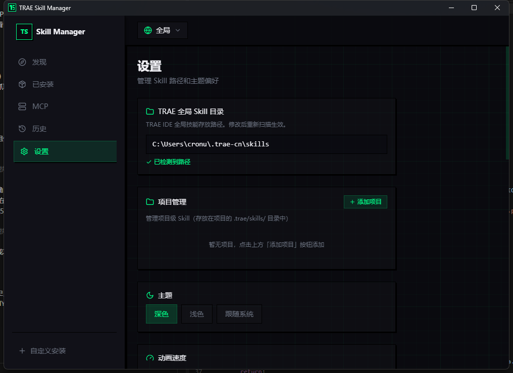

<div align="center">


# TRAE Skill Manager

*搜索、浏览并一键安装 Agent Skills 与 MCP Server 的桌面管理器*


[功能特性](#功能特性) • [安装](#安装) • [技术栈](#技术栈) • [快速开始](#快速开始) • [使用指南](#使用指南) • [目录结构](#目录结构) • [界面预览](#界面预览) • [更新日志](CHANGELOG.md)

</div>

TRAE Skill Manager 是一个基于 **Tauri + React** 的桌面应用，用于**发现、安装和管理 Agent Skills 与 MCP Server**。内置技能市场与 GitHub 社区双通道搜索，安装流程在 Rust 侧事务化执行，并实时回传终端输出。

## 功能特性

- **技能市场发现** — `全部 / 趋势 / 热门 / 收藏` 视图，支持分类、标签、来源过滤与多字段排序（安装量 / Stars / 名称 / 更新时间）
- **双通道搜索** — 内置 `skills.sh` 市场 + GitHub 社区仓库，搜索结果直接展示仓库简介与安装量
- **GitHub 技能聚合** — 内置 14 个社区技能仓库（含 `emilkowalski/skills` 等），多源并行抓取 + 版本化缓存 + 过期兜底，技能总量 2000+，无重复
- **事务化安装** — 依次尝试 `git clone → npx degit → npx skills add`，`temp → 验证 → move`，失败自动降级，全程流式输出
- **实时终端体验** — Rust 侧 `emit` 安装事件，前端 `TerminalViewer` 逐行展示 stdio 输出
- **已装技能管理** — 扫描、移除、启用 / 停用、升级与回滚
- **MCP Server 市场** — 内置分类（dev-tools / database / browser / search 等），配置对话框 + 详情面板
- **MCP 配置转译** — 一次配置，多工具同步（Claude Code / Codex / Cursor 等），自动备份与冲突检测
- **技能健康度诊断** — Token 成本分析、冲突检测、僵尸技能识别、描述质量评分
- **技能关系图** — 力导向图展示技能间关联，支持缩放、拖拽与节点详情
- **技能栈 Preset** — 内置配方 + 导入导出 `.skillpack.json` + 批量安装
- **自动更新** — 应用内检查新版本、一键升级、更新日志展示（Tauri updater + 签名校验）
- **多语言** — 简体中文 / English 界面，支持跟随系统
- **技能详情面板** — 概览 / 文档 / 文件 / 相关四个标签页，支持 README 与 SKILL.md 在线预览
- **安装历史与项目切换** — 记录每次安装操作，支持多项目路径与自定义安装位置
- **技能描述翻译** — 一键将技能描述翻译为中文，带本地缓存；未配置 AI 时自动降级为内置词库「术语对照」（本地翻译，无需联网）
- **CLI（skillctl）** — 终端搜索 / 推荐 / 安装 / 管理技能，`--json` 结构化输出，供 AI Agent 直接调用
- **MCP Server** — 7 个工具 + 资源 + 斜杠命令，让 Claude Code / Cursor / Codex / Trae 原生调用技能管理器
- **任务推荐** — `skillctl recommend "<任务描述>"` 按任务推荐技能并给出理由，无需 LLM，纯本地加权算法
- **skill-discovery 自举** — 一键把「教 AI 用 skillctl 找技能」的技能装到所有工具，形成自举闭环
- **安全边界** — 路径沙箱（拒绝 `../` 穿越）、源白名单、CLI/MCP 写操作审计（区分来源）
- **主题定制** — 亮色 / 暗色 / 跟随系统，支持自定义强调色
- **自绘标题栏** — 无边框窗口，内置边栏折叠、帮助菜单（更新日志 / 开发者工具 / 报告问题等 9 项）与窗口控制按钮
- **自定义右键菜单** — 替换系统菜单，支持刷新 / 复制 / 粘贴 / 全选 / 设置 / 退出，自动钳制在视口内
- **可折叠边栏** — 一键收缩为图标模式，释放更多内容空间

## 安装

> 从 [GitHub Releases](https://github.com/Marshall-Jimmy/trae-skill-manager/releases) 下载对应平台的安装包。

| 平台 | 安装包 | 说明 |
|------|--------|------|
| Windows | `trae-skill-manager_<版本>_x64-setup.exe`（NSIS）或 `.msi` | 双击安装，默认安装到当前用户目录 |
| macOS | `.dmg`（Apple Silicon / Intel 分别构建） | 首次打开需在「系统设置 → 隐私与安全性」中允许来自 App Store 和被认可的开发者 |
| Linux | `.deb` 或 `.AppImage` | `.deb` 用 `sudo dpkg -i` 安装；`.AppImage` 加执行权限后直接运行 |

**自动更新**：应用内置更新器，发布新版本后打开「帮助 → 检查更新...」即可一键升级。

> [!NOTE]
> 自动更新使用 Tauri updater 签名校验。发布流程见下方「发布」小节。

## 技术栈

| 层 | 技术 |
|----|------|
| 前端 | React 18 · TypeScript · Vite 5 |
| 状态管理 | Zustand（skillStore / mcpStore） |
| 动画 | motion |
| 样式 | Tailwind CSS |
| 桌面后端 | Tauri 2（Rust），命令拆分至 `commands/*` |
| 核心逻辑 | `skills-core` crate（纯 Rust，GUI / CLI / MCP 共用） |
| 命令行 / MCP | `skills-cli` crate（skillctl，clap 4 + stdio JSON-RPC） |
| 构建 | pnpm workspace · sharp 生成多尺寸图标 |

## 快速开始

> [!NOTE]
> 需要 [Node.js](https://nodejs.org) 18+ 与 [pnpm](https://pnpm.io) 11+。桌面调试还需要 [Rust](https://www.rust-lang.org) 工具链与系统 WebView 依赖。

```bash
# 安装依赖
pnpm install

# 纯前端开发（Vite）
pnpm run dev

# 桌面应用调试（Tauri）
pnpm run tauri dev

# 打包桌面安装包
pnpm run tauri build
```

## 使用指南

### 发现与安装技能

1. 打开 **发现** 页，在顶部切换「官方」或「GitHub 社区」搜索通道
2. 使用搜索框、分类、热门标签或排序下拉框筛选技能
3. 点击卡片查看详情（概览 / 文档 / 文件 / 相关），或直接点击「安装」
4. 安装过程在右侧终端面板实时展示，完成后按钮变为「已安装」

### 批量操作

勾选多张卡片后，底部会弹出批量操作栏，可一次性安装多个技能。

### 管理已装技能

在 **已安装** 页可扫描本地技能目录，支持启用 / 停用、移除、升级与回滚。

### 自定义安装

侧边栏底部「自定义安装」支持从任意 Git 仓库或本地路径安装技能，`skill_path_hint` 可递归定位技能目录。

### CLI：skillctl

`skillctl` 是随应用提供的命令行工具，让 AI Agent 与终端用户都能调用技能管理器。构建后位于 `crates/skills-cli/target/release/skillctl`（Windows 为 `skillctl.exe`）。

```bash
# 发现
skillctl search pdf                    # 搜索技能（本地缓存优先，后台刷新）
skillctl info anthropics/skills/pdf    # 查看详情，含 SKILL.md 全文
skillctl trending --limit 10           # 趋势榜
skillctl recommend "从 PDF 提取表格"    # 描述任务，推荐技能（带理由）

# 管理
skillctl list                          # 已安装（默认当前工具）
skillctl install anthropics/skills/pdf # 安装
skillctl remove pdf                    # 卸载
skillctl update                        # 升级全部
skillctl enable/disable <name>         # 启停

# 环境与安全
skillctl tools                         # 列出检测到的 AI 工具与状态
skillctl doctor                        # 健康诊断
skillctl config whitelist on           # 开启源白名单（仅允许白名单 org）
skillctl bootstrap                     # 安装 skill-discovery 自举技能到所有工具

# 服务
skillctl mcp serve                     # 以 MCP Stdio Server 启动（给 AI 用）
skillctl daemon                        # 后台 HTTP 网关（供 GUI/CLI 共享缓存）
```

所有命令支持 `--json` 结构化输出（统一信封 `{ok, data, error, warnings}`，退出码 0/1/2），以及 `--tool` / `--project` / `--yes` / `--dry-run` / `--no-network` / `--quiet` 全局参数。

### MCP Server

`skillctl mcp serve` 以 Stdio 传输启动 MCP Server，提供 **7 个工具**（`search_skills` / `get_skill_detail` / `recommend_skills_for_task` / `list_installed_skills` / `install_skill` / `remove_skill` / `detect_tools`）、**2 个资源**（`skills://installed` 等）与 **2 个斜杠命令**（`/find-skill` / `/audit-skills`）。

配置到各 AI 工具的 MCP 配置中即可：

```json
{
  "mcpServers": {
    "skill-hub": {
      "command": "skillctl",
      "args": ["mcp", "serve"]
    }
  }
}
```

> [!NOTE]
> 安全设计：`install_skill` 与 `remove_skill` 默认要求确认——AI 需先向用户复述「装什么、来自哪个仓库、装到哪」，得到同意后再带 `confirm: true` 调用。所有 CLI/MCP 触发的写操作都会记入安装历史并标注来源（`cli` / `mcp`）。

### skill-discovery 自举

在 **设置** 页点击「一键安装到所有工具」，或运行 `skillctl bootstrap`，即可把 `skill-discovery` 技能装到所有检测到的 AI 工具。之后 AI 在缺少能力时会主动用 `skillctl` 搜索并安装所需技能，形成「管理器 → 给 AI 装技能 → AI 用管理器」的自举闭环。

## 发布

三端安装包由 [GitHub Actions](.github/workflows/release.yml) 自动构建。推送 `v*` 标签即可触发：

```bash
git tag v1.0.0
git push origin v1.0.0
```

工作流会并行构建 **Windows（NSIS + MSI）/ macOS（Apple Silicon + Intel，签名公证）/ Linux（deb + AppImage）**，并将产物上传到 GitHub Release。

### 配置仓库 Secrets

发布前需在仓库 **Settings → Secrets and variables → Actions** 中配置：

| Secret | 用途 | 必填 |
|--------|------|------|
| `TAURI_SIGNING_PRIVATE_KEY` | 自动更新签名私钥（base64） | 是 |
| `TAURI_SIGNING_PRIVATE_KEY_PASSWORD` | 私钥密码 | 是 |
| `APPLE_CERTIFICATE` | macOS 开发者证书（base64 的 .p12） | macOS 签名需要 |
| `APPLE_CERTIFICATE_PASSWORD` | 证书密码 | macOS 签名需要 |
| `APPLE_SIGNING_IDENTITY` | 签名身份（如 `Developer ID Application: xxx`） | macOS 签名需要 |
| `APPLE_ID` / `APPLE_PASSWORD` / `APPLE_TEAM_ID` | Apple 公证账号 | macOS 公证需要 |

### 生成签名密钥

```bash
pnpm tauri signer generate -w ~/.tauri/trae-skill-manager.key -p <密码>
# 输出中的 Public key 已写入 src-tauri/tauri.conf.json
# 私钥文件内容（base64）作为 TAURI_SIGNING_PRIVATE_KEY 填入仓库 Secret
```

> [!WARNING]
> 私钥必须保密，一旦丢失将无法再发布可自动更新的版本。私钥文件已加入 `.gitignore`。

## 目录结构

```
trae-skill-manager/
├── src/                      # 前端
│   ├── components/           # Discover / Installed / History / Mcp / Settings / Diagnosis / Graph / Preset / DetailPanel ...
│   ├── store/                # skillStore.ts · mcpStore.ts · i18nStore.ts
│   ├── lib/                  # mcpMarketplace.ts · i18n.ts · theme.ts · motionConfig.ts
│   ├── styles/               # globals.css
│   └── types/                # 共享类型定义
├── src-tauri/                # Rust 后端
│   ├── src/
│   │   ├── commands/         # install / scan / remove / toggle / update / translate / mcp_sync / diagnose / preset / search_github / fetch / history ...
│   │   ├── models.rs         # 数据模型
│   │   ├── main.rs           # 入口与命令注册
│   │   ├── local_api.rs      # 本地 HTTP 命令网关（默认关闭，Bearer token 认证）
│   │   └── utils/path.rs     # 技能目录探测
│   └── tauri.conf.json       # Tauri 配置（含 updater 签名公钥）
├── crates/
│   ├── skills-core/          # 纯逻辑层（无 Tauri 依赖）：fetch / install / scan / tools / recommend / config / bootstrap ...
│   └── skills-cli/           # skillctl 命令行 + MCP Server（clap + stdio JSON-RPC）
├── .github/workflows/        # release.yml 三端自动构建
├── assets/                   # 图标与截图
├── BUILD.md                  # 构建指南
└── INSTALL_OPTIMIZATION_DESIGN.md  # 安装优化设计
```

## 界面预览



*发现页：技能卡片网格、分类过滤、排序与搜索。*

<div align="center">
  
  
</div>

*MCP 管理中心与设置页。*

## 文档

- [`CHANGELOG.md`](CHANGELOG.md) — 版本更新日志
- [`BUILD.md`](BUILD.md) — 构建与打包指南
- [`INSTALL_OPTIMIZATION_DESIGN.md`](INSTALL_OPTIMIZATION_DESIGN.md) — 安装流程优化设计

## 许可证

本项目基于 [GPL-3.0](LICENSE) 许可证开源。

---

<div align="center">Made by jimmma</div>
